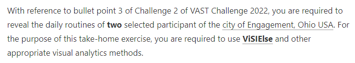

```{r setup, include=FALSE}
knitr::opts_chunk$set(echo = TRUE, eval = TRUE, message = FALSE, warning = FALSE)
```

# The Task

This [takehome exercise](https://isss608-ay2021-22april.netlify.app/th_ex/th_ex03) aims to sharpen the skill of building data visualisation programmatically using appropriate tidyverse family of packages and the preparation of statistical graphics using ggplot2 and its extensions. The specific requirements can be found in the screenshot below.



You can find the links to then datasets [here](https://vast-challenge.github.io/2022/).

# Exploration

## Initialisation

### Getting Packages

The code chunk below is used to install and load the required packages onto RStudio.

```{r}
packages = c('tidyverse', 'lubridate', 'dplyr', 'ViSiElse')
for(p in packages){
  if(!require(p,character.only = T)){
    install.packages(p)
  }
  library(p,character.only = T)
}
```

### Getting Data From ParticipantStatusLogs

I load the data in for *ParticipantStatusLogs1*, *ParticipantStatusLogs36* and *ParticipantStatusLogs71* and convert it to RDS so that it does not overload in Git using the code chunk below.

```{r, eval=FALSE}
#Loading data
ParticipantStatusLogs1 <- read_csv("data/ParticipantStatusLogs1.csv")

ParticipantStatusLogs36 <- read_csv("data/ParticipantStatusLogs36.csv")

ParticipantStatusLogs71 <- read_csv("data/ParticipantStatusLogs71.csv")

#Converting to RDS
saveRDS(ParticipantStatusLogs1, 'data/ParticipantStatusLogs1.rds')

saveRDS(ParticipantStatusLogs36, 'data/ParticipantStatusLogs36.rds')

saveRDS(ParticipantStatusLogs71, 'data/ParticipantStatusLogs71.rds')
```

```{r, eval=FALSE}
#Pinning to RDS
ParticipantStatusLogs1 <- readRDS('data/ParticipantStatusLogs1.rds')

ParticipantStatusLogs36 <- readRDS('data/ParticipantStatusLogs36.rds')

ParticipantStatusLogs71 <- readRDS('data/ParticipantStatusLogs71.rds')
```

### Choosing Participants

I choose 2 participants --- *0* and *1000*. These are arbitary numbers that serve as a stand-in for now. If the 2 participants share the same daily patterns, then I will just swap one out for another participant until we find one that has a different daily behaviour.

### Choosing Days

The file sizes are too large. From [takehome exercise](https://isss608-ay2021-22april.netlify.app/th_ex/th_ex03), I've learnt that trying to use all the data at once can either slow down or even shut down my site and functions. Instead, I choose 3 daily logs --- *ParticipantStatusLogs1*, *ParticipantStatusLogs36* and *ParticipantStatusLogs71* --- and pick out a day from each one where both participants *0* and *1000* have full information. These days will also be called Days 1, 2 and 3 from here on.

| Participant Status Log | Date Chosen |
|------------------------|-------------|
| 1                      | 2022-03-02  |
| 36                     | 2022-10-07  |
| 71                     | 2023-05-16  |

### Interpreting Activity Duration

I see that the difference between timestamps is fixed at a 5 minute interval. For simplicity, I will calculate the duration for any activity with this simple formula.

*time taken for activity (min) = (number of timestamps - 1)*

While this is not accurate, it reflects how time is spent proportionally which is enough for us to input our data into the package *ViSiElse*. We can use the following code chunk to do so.

```{r}
countListElements <- function(list) {
  return(length(list[[1]]))
}
```

### Getting Participant-Specific Data For Selected Days

First, we remove all unnecessary columns from the dataframes *ParticipantStatusLogs1*, *ParticipantStatusLogs36* and *ParticipantStatusLogs71* using the code chunk below.

```{r, eval=FALSE}
# Removing unnecessary columns
ParticipantStatusLogs1 <- ParticipantStatusLogs1[, c("participantId", "timestamp", "currentMode", "hungerStatus", "sleepStatus")]

ParticipantStatusLogs36 <- ParticipantStatusLogs36[, c("participantId", "timestamp", "currentMode", "hungerStatus", "sleepStatus")]

ParticipantStatusLogs71 <- ParticipantStatusLogs71[, c("participantId", "timestamp", "currentMode", "hungerStatus", "sleepStatus")]
```

Then we filter for participants *0* and *1000* for the dates *2022-03-02*, *2022-10-07* and *2023-05-16.*

```{r, eval=FALSE}
#Getting information from ParticipantStatusLogs1
ParticipantStatusLogs1 <- ParticipantStatusLogs1 %>%
  mutate(date = as.Date(timestamp, format = "%m/%d/%y")) 

ParticipantStatusLogs1 <- filter(ParticipantStatusLogs1, date == as.Date("2022-03-02"))

Day1Participant1 <- filter(ParticipantStatusLogs1, participantId == 0)

Day1Participant1000 <- filter(ParticipantStatusLogs1, participantId == 1000)

#Getting information from ParticipantStatusLogs36
ParticipantStatusLogs36 <- ParticipantStatusLogs36 %>%
  mutate(date = as.Date(timestamp, format = "%m/%d/%y")) 

ParticipantStatusLogs36 <- filter(ParticipantStatusLogs36, date == as.Date("2022-10-07"))

Day36Participant1 <- filter(ParticipantStatusLogs36, participantId == 0)

Day36Participant1000 <- filter(ParticipantStatusLogs36, participantId == 1000)

#Getting information from ParticipantStatusLogs71
ParticipantStatusLogs71 <- ParticipantStatusLogs71 %>%
  mutate(date = as.Date(timestamp, format = "%m/%d/%y")) 

ParticipantStatusLogs71 <- filter(ParticipantStatusLogs71, date == as.Date("2023-05-16"))

Day71Participant1 <- filter(ParticipantStatusLogs71, participantId == 0)

Day71Participant1000 <- filter(ParticipantStatusLogs71, participantId == 1000)
```

Before we proceed, let us export these dataframes into CSVs and pull from them in order to reduce the memory load on Git.

```{r, eval=FALSE}
#Exporting data
write_csv(Day1Participant1, "data\\Day1Participant1.csv")

write_csv(Day1Participant1000, "data\\Day1Participant1000.csv")

write_csv(Day36Participant1, "data\\Day36Participant1.csv")

write_csv(Day36Participant1000, "data\\Day36Participant1000.csv")

write_csv(Day71Participant1, "data\\Day71Participant1.csv")

write_csv(Day71Participant1000, "data\\Day71Participant1000.csv")
```

```{r}
#Loading data
Day1Participant1 <- read_csv("data/Day1Participant1.csv")

Day1Participant1000 <- read_csv("data/Day1Participant1000.csv")

Day36Participant1 <- read_csv("data/Day36Participant1.csv")

Day36Participant1000 <- read_csv("data/Day36Participant1000.csv")

Day71Participant1 <- read_csv("data/Day71Participant1.csv")

Day71Participant1000 <- read_csv("data/Day71Participant1000.csv")
```

Now we convert the data into the format that the package *ViSiElse*.

First, we check what are the unique values in the columns for *ParticipantStatusLogs1*, *ParticipantStatusLogs36* and *ParticipantStatusLogs71* using the code chunk below.

```{r, eval=FALSE}
#Unique column values for currentMode
unique(ParticipantStatusLogs1$currentMode)
unique(ParticipantStatusLogs36$currentMode)
unique(ParticipantStatusLogs71$currentMode)
```


```{r, eval=FALSE}
#Unique column values for hungerStatus
unique(ParticipantStatusLogs1$hungerStatus)
unique(ParticipantStatusLogs36$hungerStatus)
unique(ParticipantStatusLogs71$hungerStatus)
```


```{r, eval=FALSE}
#Unique column values for sleepStatus
unique(ParticipantStatusLogs1$sleepStatus)
unique(ParticipantStatusLogs36$sleepStatus)
unique(ParticipantStatusLogs71$sleepStatus)
```


It looks like the statuses are the same. We can proceed to build a dataframe for each participant for each day. Because the steps will be repetitive, let us first build a function.

```{r}
getUnifiedDataframe <- function(dataframe) {
  dataframeCurrentMode <- dataframe[, c("participantId", "timestamp", "currentMode")]
  dataframeCurrentMode_wide <- dataframeCurrentMode %>%
	  pivot_wider(names_from="currentMode", values_from="timestamp")
  dataframeCurrentMode_wide <- dataframeCurrentMode_wide %>% mutate_at(c("AtHome", "Transport", "AtRecreation", "AtRestaurant", "AtWork"), countListElements)
  
  #Creating for hungerStatus
	dataframeHungerStatus <- dataframe[, c("participantId", "timestamp", "hungerStatus")]
	dataframeHungerStatus_wide <- dataframeHungerStatus %>%
	  pivot_wider(names_from="hungerStatus", values_from="timestamp")
	dataframeHungerStatus_wide <- dataframeHungerStatus_wide %>% mutate_at(c("Hungry", "BecomingHungry", "BecameFull", "Starving", "JustAte"), countListElements)
	
	#Creating for sleepStatus
	dataframeSleepStatus <- dataframe[, c("participantId", "timestamp", "sleepStatus")]
	dataframeSleepStatus_wide <- dataframeSleepStatus %>%
	  pivot_wider(names_from="sleepStatus", values_from="timestamp")
	dataframeSleepStatus_wide <- dataframeSleepStatus_wide %>% mutate_at(c("Sleeping", "Awake", "PrepareToSleep"), countListElements)
	
	#Combine all 3 dataframes into 1 unifying one
	dataframeUnified <- list(dataframeCurrentMode_wide, dataframeHungerStatus_wide, dataframeSleepStatus_wide)
	
	#merge all data frames in list
	dataframeUnifiedFinal <- dataframeUnified %>% reduce(full_join, by='participantId')
	
	return(dataframeUnifiedFinal)
}
```

I realised that not all categories were found across both participants. I edited the function with the code chunk below in order to accomodate for that.

```{r}
getUnifiedDataframeModified1 <- function(dataframe) {
  dataframeCurrentMode <- dataframe[, c("participantId", "timestamp", "currentMode")]
  dataframeCurrentMode_wide <- dataframeCurrentMode %>%
	  pivot_wider(names_from="currentMode", values_from="timestamp")
  dataframeCurrentMode_wide <- dataframeCurrentMode_wide %>% mutate_at(c("AtHome", "Transport", "AtRecreation", "AtWork"), countListElements)
  
  #Creating for hungerStatus
	dataframeHungerStatus <- dataframe[, c("participantId", "timestamp", "hungerStatus")]
	dataframeHungerStatus_wide <- dataframeHungerStatus %>%
	  pivot_wider(names_from="hungerStatus", values_from="timestamp")
	dataframeHungerStatus_wide <- dataframeHungerStatus_wide %>% mutate_at(c("Hungry", "BecomingHungry", "BecameFull", "Starving", "JustAte"), countListElements)
	
	#Creating for sleepStatus
	dataframeSleepStatus <- dataframe[, c("participantId", "timestamp", "sleepStatus")]
	dataframeSleepStatus_wide <- dataframeSleepStatus %>%
	  pivot_wider(names_from="sleepStatus", values_from="timestamp")
	dataframeSleepStatus_wide <- dataframeSleepStatus_wide %>% mutate_at(c("Sleeping", "Awake", "PrepareToSleep"), countListElements)
	
	#Combine all 3 dataframes into 1 unifying one
	dataframeUnified <- list(dataframeCurrentMode_wide, dataframeHungerStatus_wide, dataframeSleepStatus_wide)
	
	#merge all data frames in list
	dataframeUnifiedFinal <- dataframeUnified %>% reduce(full_join, by='participantId')
	
	return(dataframeUnifiedFinal)
}

getUnifiedDataframe2 <- function(dataframe) {
  dataframeCurrentMode <- dataframe[, c("participantId", "timestamp", "currentMode")]
  dataframeCurrentMode_wide <- dataframeCurrentMode %>%
	  pivot_wider(names_from="currentMode", values_from="timestamp")
  dataframeCurrentMode_wide <- dataframeCurrentMode_wide %>% mutate_at(c("AtHome", "Transport", "AtRestaurant", "AtWork"), countListElements)
  
  #Creating for hungerStatus
	dataframeHungerStatus <- dataframe[, c("participantId", "timestamp", "hungerStatus")]
	dataframeHungerStatus_wide <- dataframeHungerStatus %>%
	  pivot_wider(names_from="hungerStatus", values_from="timestamp")
	dataframeHungerStatus_wide <- dataframeHungerStatus_wide %>% mutate_at(c("Hungry", "BecomingHungry", "BecameFull", "Starving", "JustAte"), countListElements)
	
	#Creating for sleepStatus
	dataframeSleepStatus <- dataframe[, c("participantId", "timestamp", "sleepStatus")]
	dataframeSleepStatus_wide <- dataframeSleepStatus %>%
	  pivot_wider(names_from="sleepStatus", values_from="timestamp")
	dataframeSleepStatus_wide <- dataframeSleepStatus_wide %>% mutate_at(c("Sleeping", "Awake"), countListElements)
	
	#Combine all 3 dataframes into 1 unifying one
	dataframeUnified <- list(dataframeCurrentMode_wide, dataframeHungerStatus_wide, dataframeSleepStatus_wide)
	
	#merge all data frames in list
	dataframeUnifiedFinal <- dataframeUnified %>% reduce(full_join, by='participantId')
	
	return(dataframeUnifiedFinal)
}

getUnifiedDataframe3 <- function(dataframe) {
  dataframeCurrentMode <- dataframe[, c("participantId", "timestamp", "currentMode")]
  dataframeCurrentMode_wide <- dataframeCurrentMode %>%
	  pivot_wider(names_from="currentMode", values_from="timestamp")
  dataframeCurrentMode_wide <- dataframeCurrentMode_wide %>% mutate_at(c("AtHome", "Transport", "AtWork", "AtRecreation"), countListElements)
  
  #Creating for hungerStatus
	dataframeHungerStatus <- dataframe[, c("participantId", "timestamp", "hungerStatus")]
	dataframeHungerStatus_wide <- dataframeHungerStatus %>%
	  pivot_wider(names_from="hungerStatus", values_from="timestamp")
	dataframeHungerStatus_wide <- dataframeHungerStatus_wide %>% mutate_at(c("Hungry", "BecomingHungry", "BecameFull", "Starving", "JustAte"), countListElements)
	
	#Creating for sleepStatus
	dataframeSleepStatus <- dataframe[, c("participantId", "timestamp", "sleepStatus")]
	dataframeSleepStatus_wide <- dataframeSleepStatus %>%
	  pivot_wider(names_from="sleepStatus", values_from="timestamp")
	dataframeSleepStatus_wide <- dataframeSleepStatus_wide %>% mutate_at(c("Sleeping", "Awake", "PrepareToSleep"), countListElements)
	
	#Combine all 3 dataframes into 1 unifying one
	dataframeUnified <- list(dataframeCurrentMode_wide, dataframeHungerStatus_wide, dataframeSleepStatus_wide)
	
	#merge all data frames in list
	dataframeUnifiedFinal <- dataframeUnified %>% reduce(full_join, by='participantId')
	
	return(dataframeUnifiedFinal)
}

getUnifiedDataframe4 <- function(dataframe) {
  dataframeCurrentMode <- dataframe[, c("participantId", "timestamp", "currentMode")]
  dataframeCurrentMode_wide <- dataframeCurrentMode %>%
	  pivot_wider(names_from="currentMode", values_from="timestamp")
  dataframeCurrentMode_wide <- dataframeCurrentMode_wide %>% mutate_at(c("AtHome", "Transport", "AtRestaurant", "AtWork"), countListElements)
  
  #Creating for hungerStatus
	dataframeHungerStatus <- dataframe[, c("participantId", "timestamp", "hungerStatus")]
	dataframeHungerStatus_wide <- dataframeHungerStatus %>%
	  pivot_wider(names_from="hungerStatus", values_from="timestamp")
	dataframeHungerStatus_wide <- dataframeHungerStatus_wide %>% mutate_at(c("Hungry", "BecomingHungry", "BecameFull", "Starving", "JustAte"), countListElements)
	
	#Creating for sleepStatus
	dataframeSleepStatus <- dataframe[, c("participantId", "timestamp", "sleepStatus")]
	dataframeSleepStatus_wide <- dataframeSleepStatus %>%
	  pivot_wider(names_from="sleepStatus", values_from="timestamp")
	dataframeSleepStatus_wide <- dataframeSleepStatus_wide %>% mutate_at(c("Sleeping", "Awake"), countListElements)
	
	#Combine all 3 dataframes into 1 unifying one
	dataframeUnified <- list(dataframeCurrentMode_wide, dataframeHungerStatus_wide, dataframeSleepStatus_wide)
	
	#merge all data frames in list
	dataframeUnifiedFinal <- dataframeUnified %>% reduce(full_join, by='participantId')
	
	return(dataframeUnifiedFinal)
}
```

Let's get the combined dataframe for the date *2022-03-02* using the code chunk below.

```{r}
# Getting unified dataframe for user 1
Day1Participant1UnifiedDataframe <- 
  getUnifiedDataframe(Day1Participant1)
Day1Participant1UnifiedDataframe['AtRecreation'] <- 0

# Getting unified dataframe for user 1000
Day1Participant1000UnifiedDataframe <- 
  getUnifiedDataframeModified1(Day1Participant1000)
#Adding column to make the columns uniform
Day1Participant1000UnifiedDataframe['AtRestaurant'] <- 0

Day1FinalDataframe <- rbind(Day1Participant1UnifiedDataframe, Day1Participant1000UnifiedDataframe)
```

Let's get the combined dataframe for the date *2022-10-07* using the code chunk below.

```{r}
# Getting unified dataframe for user 1
Day36Participant1UnifiedDataframe <- 
  getUnifiedDataframe2(Day36Participant1)
Day36Participant1UnifiedDataframe["PrepareToSleep"] <- 0
Day36Participant1UnifiedDataframe["AtRecreation"] <- 0

# Getting unified dataframe for user 1000
Day36Participant1000UnifiedDataframe <- 
  getUnifiedDataframe3(Day36Participant1000)
#Adding column to make the columns uniform
Day36Participant1000UnifiedDataframe["AtRestaurant"] <- 0

Day36FinalDataframe <- rbind(Day36Participant1UnifiedDataframe, Day36Participant1000UnifiedDataframe)
```

Let's get the combined dataframe for the date *2023-05-16* using the code chunk below.

```{r}
# Getting unified dataframe for user 1
Day71Participant1UnifiedDataframe <- 
  getUnifiedDataframe2(Day71Participant1)
#Adding column to make the columns uniform
Day71Participant1UnifiedDataframe["PrepareToSleep"] <- 0
Day71Participant1UnifiedDataframe["AtRecreation"] <- 0

# Getting unified dataframe for user 1000
Day71Participant1000UnifiedDataframe <- 
  getUnifiedDataframe2(Day71Participant1000)
Day71Participant1000UnifiedDataframe["PrepareToSleep"] <- 0
Day71Participant1000UnifiedDataframe["AtRecreation"] <- 0

Day71FinalDataframe <- rbind(Day71Participant1UnifiedDataframe, Day71Participant1000UnifiedDataframe)
```

Now that the data has been formatted, let us visualise the behaviour of both participants using the package *ViSiElse*.

We get the *ViSiElse* plot for Day *1* here.

```{r}
X <- data.frame(Day1FinalDataframe)
visi1 <- visielse(X, pixel = 5)
```

We get the *ViSiElse* plot for Day *36* here.

```{r}
Y <- data.frame(Day36FinalDataframe)
visi36 <- visielse(Y, pixel = 5)
```

We get the *ViSiElse* plot for Day *71* here.

```{r}
Z <- data.frame(Day71FinalDataframe)
visi71 <- visielse(Z, pixel = 5)
```

# Insight

## Observation

Let us assume the following.

Day *1* represents *2022-03-02*.

Day *36* represents *2022-10-07*.

Day *71* represents *2023-05-16*.

+----------------+---------+-----------+------------------------------------------------------------------------------------------------------------------------------------------+
| Action         | Similar | Different | Observation                                                                                                                              |
+================+=========+===========+==========================================================================================================================================+
| AtHome         | \-      | Y         | Difference narrowed from Day 1 to Day 36 and then remained after.                                                                        |
|                |         |           |                                                                                                                                          |
|                |         |           | Participant 1000 spent more time at home.                                                                                                |
+----------------+---------+-----------+------------------------------------------------------------------------------------------------------------------------------------------+
| Transport      | \-      | Y         | Difference narrowed from Day 1 to Day 36 and then remained after.                                                                        |
|                |         |           |                                                                                                                                          |
|                |         |           | Participant 1 spent more time on transport.                                                                                              |
+----------------+---------+-----------+------------------------------------------------------------------------------------------------------------------------------------------+
| AtWork         | Y       | \-        | Both participants spent consistently large amounts of time at work.                                                                      |
+----------------+---------+-----------+------------------------------------------------------------------------------------------------------------------------------------------+
| AtRestaurant   | Y       | \-        | Both participants spent consistently small amounts of time at restaurant.                                                                |
+----------------+---------+-----------+------------------------------------------------------------------------------------------------------------------------------------------+
| Hungry         | \-      | Y         | Participant 1 started off hungrier than participant 1000, but both participants became equally hungry over time.                         |
+----------------+---------+-----------+------------------------------------------------------------------------------------------------------------------------------------------+
| Starving       | \-      | Y         | Participant 1000 is consistently hungrier than participant 1.                                                                            |
+----------------+---------+-----------+------------------------------------------------------------------------------------------------------------------------------------------+
| JustAte        | Y       | \-        | Both participants spent consistently small amounts of time just eating.                                                                  |
+----------------+---------+-----------+------------------------------------------------------------------------------------------------------------------------------------------+
| BecameFull     | Y       | \-        | Both participants spent consistently moderate amounts of time becoming full.                                                             |
+----------------+---------+-----------+------------------------------------------------------------------------------------------------------------------------------------------+
| BecomingHungry | \-      | Y         | Participant 1 consistently takes longer to become hungry than participant 1000.                                                          |
+----------------+---------+-----------+------------------------------------------------------------------------------------------------------------------------------------------+
| Sleeping       | \-      | Y         | Participant 1 consistently sleeps longer than participant 1000.                                                                          |
+----------------+---------+-----------+------------------------------------------------------------------------------------------------------------------------------------------+
| Awake          | \-      | Y         | Participant 1 is consistently awake longer than participant 1000.                                                                        |
+----------------+---------+-----------+------------------------------------------------------------------------------------------------------------------------------------------+
| PrepareToSleep | Y       | \-        | Both participants spent consistently small amounts of time preparing to sleep.                                                           |
+----------------+---------+-----------+------------------------------------------------------------------------------------------------------------------------------------------+
| AtRecreation   | Y       | \-        | Both participants spent consistently small amounts of time at recreation. In fact, both participants almost spent no time on recreation. |
+----------------+---------+-----------+------------------------------------------------------------------------------------------------------------------------------------------+

## Making Sense Of It

### Similarity

It is interesting to see that both participants spend the same amount of time at work and at restaurants. This leads me to assume that life in \*Engagement\* could be very regimented.

Also, both participants spend very little time on recreation. This leads me to assume that it could be because both of them work at jobs that have an intense schedule with very little work-life balance that they also spend the same amounts of time at work and at restaurants.

### Difference

The difference in time at home at work also supports this hypothesis. Both participants spend the same amount of time away from work, just in different ways.

Based on the difference in time being hungry, becoming hungry, sleeping and being awake, participant 1 also spends far more time recuperating. This could be because participant 1 spends less time at home and more time on the road, which might tire the person out more.
