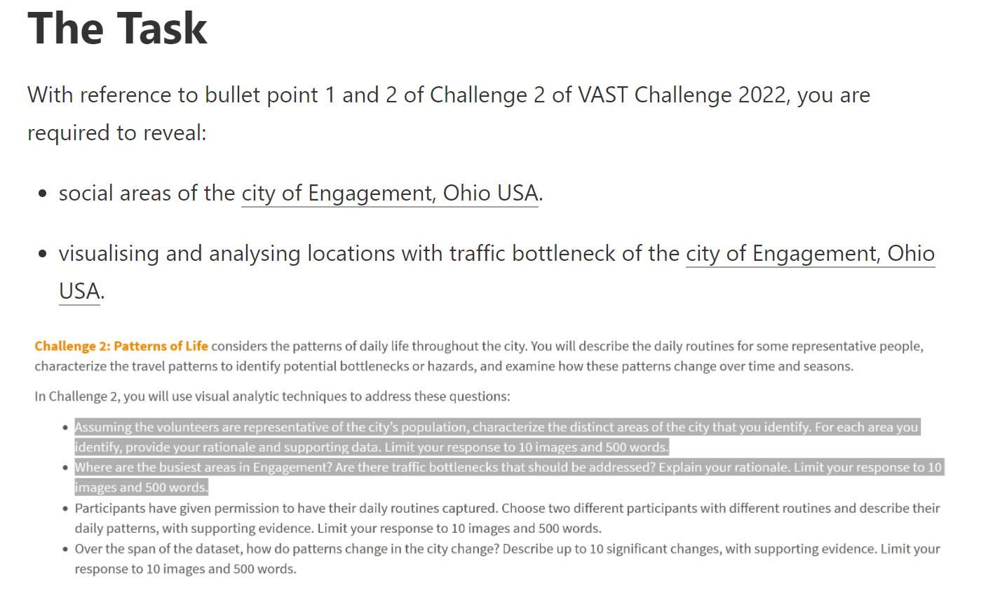

```{r setup, include=FALSE}
knitr::opts_chunk$set(echo = TRUE, eval = TRUE, message = FALSE, warning = FALSE)
```

# The Task

This [takehome exercise](https://isss608-ay2021-22april.netlify.app/th_ex/th_ex05) aims to sharpen the skill of building data visualisation programmatically using appropriate tidyverse family of packages and the preparation of statistical graphics using ggplot2 and its extensions. The specific requirements can be found in the screenshot below.



You can find the links to then datasets [here](https://vast-challenge.github.io/2022/).

# Exploration

## Initialisation

### Getting Packages

The code chunk below is used to install and load the required packages onto RStudio.

```{r}
packages = c('sf', 'tmap', 'tidyverse', 
             'lubridate', 'clock', 'sftime', 
             'rmarkdown', 'dplyr', 'readr')
for (p in packages){
  if(!require(p, character.only = T)){
    install.packages(p)
  }
  library(p,character.only = T)
}
```

### Getting Data

#### Data For The Types of Buildings and Their Max Occupancy

The code chunk below is used to load the necessary data.

```{r, eval=FALSE}
buildings <- read_sf("data/takehome_exercise_5/Buildings.csv", 
                   options = "GEOM_POSSIBLE_NAMES=location")

schools <- read_csv("data/takehome_exercise_5/Schools.csv")

pubs <- read_csv("data/takehome_exercise_5/Pubs.csv")

apartments <- read_csv("data/takehome_exercise_5/Apartments.csv")

employers <- read_csv("data/takehome_exercise_5/Employers.csv")

restaurants <- read_csv("data/takehome_exercise_5/Restaurants.csv")

checkInJournal <- read_csv("data/takehome_exercise_5/CheckInJournal.csv")
```

The *buildings* dataset represents every building in Engagement. However, it does not give enough information about what each building is. To do that, we have to combine it with the *apartments*, *employers*, *pubs*, *restaurants* and *schools* datasets. We do that with the code chunks below.

```{r, eval=FALSE}
# Reformat datasets apartments, employers, pubs and restaurants

# Apartments
apartments <- apartments[,c("buildingId", "maxOccupancy")]
apartments$buildingType <- "Apartment"

# Employers
employers <- employers[,c("buildingId")]
employers$maxOccupancy <- ""
employers$buildingType <- "Employer"

# Pubs
pubs <- pubs[,c("buildingId", "maxOccupancy")]
pubs$buildingType <- "Pub"

# Restaurants
restaurants <- restaurants[,c("buildingId", "maxOccupancy")]
restaurants$buildingType <- "Restaurant"

# Schools
schools <- schools[,c("buildingId", "maxEnrollment")]
schools$buildingType <- "School"
names(schools)[names(schools) == 'maxEnrollment'] <- "maxOccupancy"

# Combine reformatted datasets
intermediate_buildings <- rbind(apartments, employers, pubs, restaurants, schools)

# Combine reformatted datasets
intermediate_buildings <- rbind(apartments, employers, pubs, restaurants, schools)

# Remove duplicates
intermediate_buildings_unique <- unique(intermediate_buildings)
```

```{r, eval=FALSE}
# Now we combine the dataset intermediate_buildings_unique with the dataset buildings to give as many buildings in Engagement a category as possible
buildings_test <- merge(x = buildings, y = intermediate_buildings_unique, by = "buildingId", all.x = TRUE)

# We combine the building types
names(buildings_test)[names(buildings_test) == 'buildingType.x'] <- "Generic"

names(buildings_test)[names(buildings_test) == 'buildingType.y'] <- "Specific"

buildings_test$buildingType <- ifelse(is.na(buildings_test$Specific), buildings_test$Generic , buildings_test$Specific)

buildings_test <- buildings_test[, !(colnames(buildings_test) %in% c("Specific","Generic"))]
```

```{r, eval=FALSE}
# And then we "combine" the max occupancies by taking maxOccupancies.x since it has less empty/ NA values
buildings_test <- buildings_test[, !(colnames(buildings_test) %in% c("maxOccupancy.y"))]

names(buildings_test)[names(buildings_test) == 'maxOccupancy.x'] <- "maxOccupancy"
```

```{r, eval=FALSE}
# Lastly, I remove the column units from the dataset buildings_test too
buildings_test <- buildings_test[, !(colnames(buildings_test) %in% c("units"))]
```

To avoid having to push too much data into Git, we export dataset *buildings_test* and import it back using the code chunk below.

```{r, eval=FALSE}
write_csv(buildings_test, "data/final_buildings.csv")
```

```{r, eval=FALSE}
final_buildings <- read_csv("data/final_buildings.csv")
```

#### Data For Traffic To Each Building

Now we have to wrangle the data for participant activity in these buildings. We do so with the code chunk below.

```{r, eval=FALSE}
# We convert the data into daily data. Handling hourly or even minute by minute data would be too computationally intense. 
checkInJournal <- checkInJournal %>%
  mutate(timestamp = as.Date(timestamp, format = "%m/%d/%y"))

checkInJournal$timestamp <- format(as.Date(checkInJournal$timestamp), "%Y-%m")

# Next we remove the columns participantId and venueType since we already have that data in the dataset final_buildings
checkInJournal <- checkInJournal[, !(colnames(checkInJournal) %in% c("participantId", "venueType"))]

# Now we get the monthly usage of each building
CheckInJournal2 <- checkInJournal %>%  
  group_by(timestamp, venueId) %>% 
  summarise(monthlyUsage = n()) 
```

```{r, eval=FALSE}
# Now we create datasets for each month's data usage and rename the columns
Mar22 <- filter(CheckInJournal2, timestamp == "2022-03")
names(Mar22)[names(Mar22) == 'monthlyUsage'] <- "Mar22"
names(Mar22)[names(Mar22) == 'venueId'] <- "buildingId"
Mar22 <- Mar22[, !(colnames(Mar22) %in% c("timestamp"))]

Apr22 <- filter(CheckInJournal2, timestamp == "2022-04")
names(Apr22)[names(Apr22) == 'monthlyUsage'] <- "Apr22"
names(Apr22)[names(Apr22) == 'venueId'] <- "buildingId"
Apr22 <- Apr22[, !(colnames(Apr22) %in% c("timestamp"))]

May22 <- filter(CheckInJournal2, timestamp == "2022-05")
names(May22)[names(May22) == 'monthlyUsage'] <- "May22"
names(May22)[names(May22) == 'venueId'] <- "buildingId"
May22 <- May22[, !(colnames(May22) %in% c("timestamp"))]

Jun22 <- filter(CheckInJournal2, timestamp == "2022-06")
names(Jun22)[names(Jun22) == 'monthlyUsage'] <- "Jun22"
names(Jun22)[names(Jun22) == 'venueId'] <- "buildingId"
Jun22 <- Jun22[, !(colnames(Jun22) %in% c("timestamp"))]

Jul22 <- filter(CheckInJournal2, timestamp == "2022-07")
names(Jul22)[names(Jul22) == 'monthlyUsage'] <- "Jul22"
names(Jul22)[names(Jul22) == 'venueId'] <- "buildingId"
Jul22 <- Jul22[, !(colnames(Jul22) %in% c("timestamp"))]

Aug22 <- filter(CheckInJournal2, timestamp == "2022-08")
names(Aug22)[names(Aug22) == 'monthlyUsage'] <- "Aug22"
names(Aug22)[names(Aug22) == 'venueId'] <- "buildingId"
Aug22 <- Aug22[, !(colnames(Aug22) %in% c("timestamp"))]

Sep22 <- filter(CheckInJournal2, timestamp == "2022-09")
names(Sep22)[names(Sep22) == 'monthlyUsage'] <- "Sep22"
names(Sep22)[names(Sep22) == 'venueId'] <- "buildingId"
Sep22 <- Sep22[, !(colnames(Sep22) %in% c("timestamp"))]

Oct22 <- filter(CheckInJournal2, timestamp == "2022-10")
names(Oct22)[names(Oct22) == 'monthlyUsage'] <- "Oct22"
names(Oct22)[names(Oct22) == 'venueId'] <- "buildingId"
Oct22 <- Oct22[, !(colnames(Oct22) %in% c("timestamp"))]

Nov22 <- filter(CheckInJournal2, timestamp == "2022-11")
names(Nov22)[names(Nov22) == 'monthlyUsage'] <- "Nov22"
names(Nov22)[names(Nov22) == 'venueId'] <- "buildingId"
Nov22 <- Nov22[, !(colnames(Nov22) %in% c("timestamp"))]

Dec22 <- filter(CheckInJournal2, timestamp == "2022-12")
names(Dec22)[names(Dec22) == 'monthlyUsage'] <- "Dec22"
names(Dec22)[names(Dec22) == 'venueId'] <- "buildingId"
Dec22 <- Dec22[, !(colnames(Dec22) %in% c("timestamp"))]

Jan23 <- filter(CheckInJournal2, timestamp == "2023-01")
names(Jan23)[names(Jan23) == 'monthlyUsage'] <- "Jan23"
names(Jan23)[names(Jan23) == 'venueId'] <- "buildingId"
Jan23 <- Jan23[, !(colnames(Jan23) %in% c("timestamp"))]

Feb23 <- filter(CheckInJournal2, timestamp == "2023-02")
names(Feb23)[names(Feb23) == 'monthlyUsage'] <- "Feb23"
names(Feb23)[names(Feb23) == 'venueId'] <- "buildingId"
Feb23 <- Feb23[, !(colnames(Feb23) %in% c("timestamp"))]

Mar23 <- filter(CheckInJournal2, timestamp == "2023-03")
names(Mar23)[names(Mar23) == 'monthlyUsage'] <- "Mar23"
names(Mar23)[names(Mar23) == 'venueId'] <- "buildingId"
Mar23 <- Mar23[, !(colnames(Mar23) %in% c("timestamp"))]

Apr23 <- filter(CheckInJournal2, timestamp == "2023-04")
names(Apr23)[names(Apr23) == 'monthlyUsage'] <- "Apr23"
names(Apr23)[names(Apr23) == 'venueId'] <- "buildingId"
Apr23 <- Apr23[, !(colnames(Apr23) %in% c("timestamp"))]

May23 <- filter(CheckInJournal2, timestamp == "2023-05")
names(May23)[names(May23) == 'monthlyUsage'] <- "May23"
names(May23)[names(May23) == 'venueId'] <- "buildingId"
May23 <- May23[, !(colnames(May23) %in% c("timestamp"))]
```

#### Data For The Types of Buildings, Their Max Occupancy and Traffic To Each Building

Now we combine the datasets that we have obtained above in order to compare the columns maxOccupancy, with the monthly usage.

```{r, eval=FALSE}
final_buildings <- merge(x = final_buildings, y = Mar22, by = "buildingId", all.x = TRUE)

final_buildings <- merge(x = final_buildings, y = Apr22, by = "buildingId", all.x = TRUE)

final_buildings <- merge(x = final_buildings, y = May22, by = "buildingId", all.x = TRUE)

final_buildings <- merge(x = final_buildings, y = Jun22, by = "buildingId", all.x = TRUE)

final_buildings <- merge(x = final_buildings, y = Jul22, by = "buildingId", all.x = TRUE)

final_buildings <- merge(x = final_buildings, y = Aug22, by = "buildingId", all.x = TRUE)

final_buildings <- merge(x = final_buildings, y = Sep22, by = "buildingId", all.x = TRUE)

final_buildings <- merge(x = final_buildings, y = Oct22, by = "buildingId", all.x = TRUE)

final_buildings <- merge(x = final_buildings, y = Nov22, by = "buildingId", all.x = TRUE)

final_buildings <- merge(x = final_buildings, y = Dec22, by = "buildingId", all.x = TRUE)

final_buildings <- merge(x = final_buildings, y = Jan23, by = "buildingId", all.x = TRUE)

final_buildings <- merge(x = final_buildings, y = Feb23, by = "buildingId", all.x = TRUE)

final_buildings <- merge(x = final_buildings, y = Mar23, by = "buildingId", all.x = TRUE)

final_buildings <- merge(x = final_buildings, y = Apr23, by = "buildingId", all.x = TRUE)

final_buildings <- merge(x = final_buildings, y = May23, by = "buildingId", all.x = TRUE)
```

And we bring the monthly usage down to daily usage to make the comparison a little easier.

```{r, eval=FALSE}
final_buildings <- final_buildings %>% 
   mutate(Mar22Daily = Mar22 / 31) %>% 
   mutate(Apr22Daily = Apr22 / 30) %>% 
   mutate(May22Daily = May22 / 31) %>% 
   mutate(Jun22Daily = Jun22 / 30) %>% 
   mutate(Jul22Daily = Jul22 / 31) %>% 
   mutate(Aug22Daily = Aug22 / 31) %>% 
   mutate(Sep22Daily = Sep22 / 30) %>% 
   mutate(Oct22Daily = Oct22 / 31) %>% 
   mutate(Nov22Daily = Nov22 / 30) %>% 
   mutate(Dec22Daily = Dec22 / 31) %>% 
   mutate(Jan23Daily = Jan23 / 31) %>% 
   mutate(Feb23Daily = Feb23 / 28) %>% 
   mutate(Mar23Daily = Mar23 / 31) %>% 
   mutate(Apr23Daily = Apr23 / 30) %>% 
   mutate(May23Daily = May23 / 31)
```

Let us add one last column to show how close the building is to being overoccupied.

```{r, eval=FALSE}
final_buildings <- final_buildings %>% 
  mutate(overOccupiedMar22Daily =
           if_else(
             (is.na(final_buildings$maxOccupancy) | is.na(final_buildings$Mar22Daily)), 
             0.00, 
             (final_buildings$Mar22Daily/ final_buildings$maxOccupancy))) %>% 
  mutate(overOccupiedApr22Daily =
           if_else(
             (is.na(final_buildings$maxOccupancy) | is.na(final_buildings$Apr22Daily)), 
             0.00, 
             (final_buildings$Apr22Daily/ final_buildings$maxOccupancy))) %>% 
  mutate(overOccupiedMay22Daily =
           if_else(
             (is.na(final_buildings$maxOccupancy) | is.na(final_buildings$May22Daily)), 
             0.00, 
             (final_buildings$May22Daily/ final_buildings$maxOccupancy))) %>% 
  mutate(overOccupiedJun22Daily =
           if_else(
             (is.na(final_buildings$maxOccupancy) | is.na(final_buildings$Jun22Daily)), 
             0.00, 
             (final_buildings$Jun22Daily/ final_buildings$maxOccupancy))) %>% 
  mutate(overOccupiedJul22Daily =
           if_else(
             (is.na(final_buildings$maxOccupancy) | is.na(final_buildings$Jul22Daily)), 
             0.00, 
             (final_buildings$Jul22Daily/ final_buildings$maxOccupancy))) %>% 
  mutate(overOccupiedAug22Daily =
           if_else(
             (is.na(final_buildings$maxOccupancy) | is.na(final_buildings$Aug22Daily)), 
             0.00, 
             (final_buildings$Aug22Daily/ final_buildings$maxOccupancy))) %>% 
  mutate(overOccupiedSep22Daily =
           if_else(
             (is.na(final_buildings$maxOccupancy) | is.na(final_buildings$Sep22Daily)), 
             0.00, 
             (final_buildings$Sep22Daily/ final_buildings$maxOccupancy))) %>% 
  mutate(overOccupiedOct22Daily =
           if_else(
             (is.na(final_buildings$maxOccupancy) | is.na(final_buildings$Oct22Daily)), 
             0.00, 
             (final_buildings$Oct22Daily/ final_buildings$maxOccupancy))) %>% 
  mutate(overOccupiedNov22Daily =
           if_else(
             (is.na(final_buildings$maxOccupancy) | is.na(final_buildings$Nov22Daily)), 
             0.00, 
             (final_buildings$Nov22Daily/ final_buildings$maxOccupancy))) %>% 
  mutate(overOccupiedDec22Daily =
           if_else(
             (is.na(final_buildings$maxOccupancy) | is.na(final_buildings$Dec22Daily)), 
             0.00, 
             (final_buildings$Dec22Daily/ final_buildings$maxOccupancy))) %>% 
  mutate(overOccupiedJan23Daily =
           if_else(
             (is.na(final_buildings$maxOccupancy) | is.na(final_buildings$Jan23Daily)), 
             0.00, 
             (final_buildings$Jan23Daily/ final_buildings$maxOccupancy))) %>% 
  mutate(overOccupiedFeb23Daily =
           if_else(
             (is.na(final_buildings$maxOccupancy) | is.na(final_buildings$Feb23Daily)), 
             0.00, 
             (final_buildings$Feb23Daily/ final_buildings$maxOccupancy))) %>% 
  mutate(overOccupiedApr23Daily =
           if_else(
             (is.na(final_buildings$maxOccupancy) | is.na(final_buildings$Apr23Daily)), 
             0.00, 
             (final_buildings$Apr23Daily/ final_buildings$maxOccupancy))) %>% 
  mutate(overOccupiedMay23Daily =
           if_else(
             (is.na(final_buildings$maxOccupancy) | is.na(final_buildings$May23Daily)), 
             0.00, 
             (final_buildings$May23Daily/ final_buildings$maxOccupancy))) 

# Let us make sure there are no duplicates
final_buildings <- unique(final_buildings)
```

Let us export the dataset *final_buildings* and import it again to prevent git from crashing.

```{r, eval=FALSE}
write_csv(final_buildings, "data/final_buildings_2.csv")
```

*Please note that some changes were made to the CSV final_buildings_2. Hence, there is a change in the versioning. However, it was too minor to add here.*

```{r}
final_final_buildings <- read_sf("data/final_buildings_4.csv", 
                   options = "GEOM_POSSIBLE_NAMES=location")
```

# Visualisation

## Answering Question 1

The code chunk below plots the building polygon features by using *tm_polygon()*.

```{r}
tmap_mode("plot")
tm_shape(final_final_buildings)+
tm_polygons(col = "buildingType",
           palette="Accent",
           border.col = "black",
           border.alpha = .5,
           border.lwd = 0.5)
tmap_mode("plot")
```

Now let us get use the same colour palette to identify the buildings, while using the size of circles to represent how social the areas are each month.

### March 2022

```{r}
final_final_buildings$A = as.numeric(final_final_buildings$A)
tm_shape(final_final_buildings)+
tm_bubbles(col = "buildingType",
           alpha = 0.8,
           n = 6,
           style = "jenks",
           palette="Accent",
           size = "A",
           scale = 0.8,
           border.col = "black",
           border.lwd = 0.5)
```

### Apr 2022

```{r}
final_final_buildings$B = as.numeric(final_final_buildings$B)
tm_shape(final_final_buildings)+
tm_bubbles(col = "buildingType",
           alpha = 0.8,
           n = 6,
           style = "jenks",
           palette="Accent",
           size = "B",
           scale = 0.8,
           border.col = "black",
           border.lwd = 0.5)
```

### May 2022

```{r}
final_final_buildings$C = as.numeric(final_final_buildings$C)
tm_shape(final_final_buildings)+
tm_bubbles(col = "buildingType",
           alpha = 0.8,
           n = 6,
           style = "jenks",
           palette="Accent",
           size = "C",
           scale = 0.8,
           border.col = "black",
           border.lwd = 0.5)
```

### June 2022

```{r}
final_final_buildings$D = as.numeric(final_final_buildings$D)
tm_shape(final_final_buildings)+
tm_bubbles(col = "buildingType",
           alpha = 0.8,
           n = 6,
           style = "jenks",
           palette="Accent",
           size = "D",
           scale = 0.8,
           border.col = "black",
           border.lwd = 0.5)
```

### July 2022

```{r}
final_final_buildings$E = as.numeric(final_final_buildings$E)
tm_shape(final_final_buildings)+
tm_bubbles(col = "buildingType",
           alpha = 0.8,
           n = 6,
           style = "jenks",
           palette="Accent",
           size = "E",
           scale = 0.8,
           border.col = "black",
           border.lwd = 0.5)
```

### August 2022

```{r}
final_final_buildings$F = as.numeric(final_final_buildings$F)
tm_shape(final_final_buildings)+
tm_bubbles(col = "buildingType",
           alpha = 0.8,
           n = 6,
           style = "jenks",
           palette="Accent",
           size = "F",
           scale = 0.8,
           border.col = "black",
           border.lwd = 0.5)
```

### September 2022

```{r}
final_final_buildings$G = as.numeric(final_final_buildings$G)
tm_shape(final_final_buildings)+
tm_bubbles(col = "buildingType",
           alpha = 0.8,
           n = 6,
           style = "jenks",
           palette="Accent",
           size = "G",
           scale = 0.8,
           border.col = "black",
           border.lwd = 0.5)
```

### October 2022

```{r}
final_final_buildings$H = as.numeric(final_final_buildings$H)
tm_shape(final_final_buildings)+
tm_bubbles(col = "buildingType",
           alpha = 0.8,
           n = 6,
           style = "jenks",
           palette="Accent",
           size = "H",
           scale = 0.8,
           border.col = "black",
           border.lwd = 0.5)
```

### November 2022

```{r}
final_final_buildings$I = as.numeric(final_final_buildings$I)
tm_shape(final_final_buildings)+
tm_bubbles(col = "buildingType",
           alpha = 0.8,
           n = 6,
           style = "jenks",
           palette="Accent",
           size = "I",
           scale = 0.8,
           border.col = "black",
           border.lwd = 0.5)
```

### December 2022

```{r}
final_final_buildings$J = as.numeric(final_final_buildings$J)
tm_shape(final_final_buildings)+
tm_bubbles(col = "buildingType",
           alpha = 0.8,
           n = 6,
           style = "jenks",
           palette="Accent",
           size = "J",
           scale = 0.8,
           border.col = "black",
           border.lwd = 0.5)
```

### January 2023

```{r}
final_final_buildings$K = as.numeric(final_final_buildings$K)
tm_shape(final_final_buildings)+
tm_bubbles(col = "buildingType",
           alpha = 0.8,
           n = 6,
           style = "jenks",
           palette="Accent",
           size = "K",
           scale = 0.8,
           border.col = "black",
           border.lwd = 0.5)
```

### February 2023

```{r}
final_final_buildings$L = as.numeric(final_final_buildings$L)
tm_shape(final_final_buildings)+
tm_bubbles(col = "buildingType",
           alpha = 0.8,
           n = 6,
           style = "jenks",
           palette="Accent",
           size = "L",
           scale = 0.8,
           border.col = "black",
           border.lwd = 0.5)
```

### March 2023

```{r}
final_final_buildings$M = as.numeric(final_final_buildings$M)
tm_shape(final_final_buildings)+
tm_bubbles(col = "buildingType",
           alpha = 0.8,
           n = 6,
           style = "jenks",
           palette="Accent",
           size = "M",
           scale = 0.8,
           border.col = "black",
           border.lwd = 0.5)
```

### April 2023

```{r}
final_final_buildings$N = as.numeric(final_final_buildings$N)
tm_shape(final_final_buildings)+
tm_bubbles(col = "buildingType",
           alpha = 0.8,
           n = 6,
           style = "jenks",
           palette="Accent",
           size = "N",
           scale = 0.8,
           border.col = "black",
           border.lwd = 0.5)
```

### May 2023

```{r}
final_final_buildings$O = as.numeric(final_final_buildings$O)
tm_shape(final_final_buildings)+
tm_bubbles(col = "buildingType",
           alpha = 0.8,
           n = 6,
           style = "jenks",
           palette="Accent",
           size = "O",
           scale = 0.8,
           border.col = "black",
           border.lwd = 0.5)
```

### Insight

To answer the first question:


Based on the tmaps over time, it seems that the social areas are quite consistent. If we base it off the total number of significantly large bubbles, the most social areas in descending order are:

1.  Apartments
2.  Employer
3.  Commercial

## Answering Question 2

We essentially do the same thing as *Question 1* but using the over-occupancy metrics such as *overOccupiedMar22Daily*.

### March 2022

```{r}
final_final_buildings$overOccupiedMar22Daily = as.numeric(final_final_buildings$overOccupiedMar22Daily)
tm_shape(final_final_buildings)+
tm_bubbles(col = "buildingType",
           alpha = 0.8,
           n = 6,
           style = "jenks",
           palette="Accent",
           size = "overOccupiedMar22Daily",
           scale = 0.8,
           border.col = "black",
           border.lwd = 0.5)
```

### Apr 2022

```{r}
final_final_buildings$overOccupiedApr22Daily = as.numeric(final_final_buildings$overOccupiedApr22Daily)
tm_shape(final_final_buildings)+
tm_bubbles(col = "buildingType",
           alpha = 0.8,
           n = 6,
           style = "jenks",
           palette="Accent",
           size = "overOccupiedApr22Daily",
           scale = 0.8,
           border.col = "black",
           border.lwd = 0.5)
```

### May 2022

```{r}
final_final_buildings$overOccupiedMay22Daily = as.numeric(final_final_buildings$overOccupiedMay22Daily)
tm_shape(final_final_buildings)+
tm_bubbles(col = "buildingType",
           alpha = 0.8,
           n = 6,
           style = "jenks",
           palette="Accent",
           size = "overOccupiedMay22Daily",
           scale = 0.8,
           border.col = "black",
           border.lwd = 0.5)
```

### June 2022

```{r}
final_final_buildings$overOccupiedJun22Daily = as.numeric(final_final_buildings$overOccupiedJun22Daily)
tm_shape(final_final_buildings)+
tm_bubbles(col = "buildingType",
           alpha = 0.8,
           n = 6,
           style = "jenks",
           palette="Accent",
           size = "overOccupiedJun22Daily",
           scale = 0.8,
           border.col = "black",
           border.lwd = 0.5)
```

### July 2022

```{r}
final_final_buildings$overOccupiedJul22Daily = as.numeric(final_final_buildings$overOccupiedJul22Daily)
tm_shape(final_final_buildings)+
tm_bubbles(col = "buildingType",
           alpha = 0.8,
           n = 6,
           style = "jenks",
           palette="Accent",
           size = "overOccupiedJul22Daily",
           scale = 0.8,
           border.col = "black",
           border.lwd = 0.5)
```

### August 2022

```{r}
final_final_buildings$overOccupiedAug22Daily = as.numeric(final_final_buildings$overOccupiedAug22Daily)
tm_shape(final_final_buildings)+
tm_bubbles(col = "buildingType",
           alpha = 0.8,
           n = 6,
           style = "jenks",
           palette="Accent",
           size = "overOccupiedAug22Daily",
           scale = 0.8,
           border.col = "black",
           border.lwd = 0.5)
```

### September 2022

```{r}
final_final_buildings$overOccupiedSep22Daily = as.numeric(final_final_buildings$overOccupiedSep22Daily)
tm_shape(final_final_buildings)+
tm_bubbles(col = "buildingType",
           alpha = 0.8,
           n = 6,
           style = "jenks",
           palette="Accent",
           size = "overOccupiedSep22Daily",
           scale = 0.8,
           border.col = "black",
           border.lwd = 0.5)
```

### October 2022

```{r}
final_final_buildings$overOccupiedOct22Daily = as.numeric(final_final_buildings$overOccupiedOct22Daily)
tm_shape(final_final_buildings)+
tm_bubbles(col = "buildingType",
           alpha = 0.8,
           n = 6,
           style = "jenks",
           palette="Accent",
           size = "overOccupiedOct22Daily",
           scale = 0.8,
           border.col = "black",
           border.lwd = 0.5)
```

### November 2022

```{r}
final_final_buildings$overOccupiedNov22Daily = as.numeric(final_final_buildings$overOccupiedNov22Daily)
tm_shape(final_final_buildings)+
tm_bubbles(col = "buildingType",
           alpha = 0.8,
           n = 6,
           style = "jenks",
           palette="Accent",
           size = "overOccupiedNov22Daily",
           scale = 0.8,
           border.col = "black",
           border.lwd = 0.5)
```

### December 2022

```{r}
final_final_buildings$overOccupiedDec22Daily = as.numeric(final_final_buildings$overOccupiedDec22Daily)
tm_shape(final_final_buildings)+
tm_bubbles(col = "buildingType",
           alpha = 0.8,
           n = 6,
           style = "jenks",
           palette="Accent",
           size = "overOccupiedDec22Daily",
           scale = 0.8,
           border.col = "black",
           border.lwd = 0.5)
```

### January 2023

```{r}
final_final_buildings$overOccupiedJan23Daily = as.numeric(final_final_buildings$overOccupiedJan23Daily)
tm_shape(final_final_buildings)+
tm_bubbles(col = "buildingType",
           alpha = 0.8,
           n = 6,
           style = "jenks",
           palette="Accent",
           size = "overOccupiedJan23Daily",
           scale = 0.8,
           border.col = "black",
           border.lwd = 0.5)
```

### February 2023

```{r}
final_final_buildings$overOccupiedFeb23Daily = as.numeric(final_final_buildings$overOccupiedFeb23Daily)
tm_shape(final_final_buildings)+
tm_bubbles(col = "buildingType",
           alpha = 0.8,
           n = 6,
           style = "jenks",
           palette="Accent",
           size = "overOccupiedFeb23Daily",
           scale = 0.8,
           border.col = "black",
           border.lwd = 0.5)
```

### April 2023

```{r}
final_final_buildings$overOccupiedApr23Daily = as.numeric(final_final_buildings$overOccupiedApr23Daily)
tm_shape(final_final_buildings)+
tm_bubbles(col = "buildingType",
           alpha = 0.8,
           n = 6,
           style = "jenks",
           palette="Accent",
           size = "overOccupiedApr23Daily",
           scale = 0.8,
           border.col = "black",
           border.lwd = 0.5)
```

### May 2023

```{r}
final_final_buildings$overOccupiedMay23Daily = as.numeric(final_final_buildings$overOccupiedMay23Daily)
tm_shape(final_final_buildings)+
tm_bubbles(col = "buildingType",
           alpha = 0.8,
           n = 6,
           style = "jenks",
           palette="Accent",
           size = "overOccupiedMay23Daily",
           scale = 0.8,
           border.col = "black",
           border.lwd = 0.5)
```

### Insight

To answer the second question:


Based on the tmaps over time, it does seem like that there are minimal bottlenecks. And that the worst ones are experienced by apartments since the size of the "over-occupancy" bubbles are the highest for them.

# Review

I believe that the visualisation hardly revealed any information because the difference in magnitude between the most "social" and most severely "bottleneck" areas, and the other areas was too drastic. 

To solve this problem, I could have implemented an additional layer of visual analysis by capping the upper limit for the level of "social" or "bottleneck" in buildings in *Engagement*. 
Instead of producing 24 different graphs, this question was also a great opportunity for dynamic analysis. 


