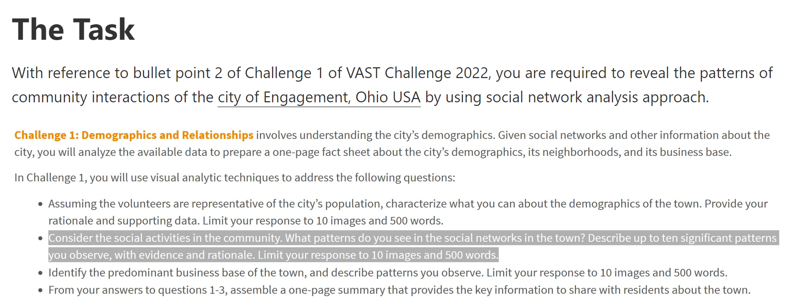
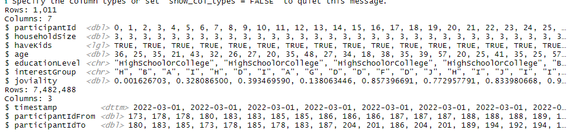
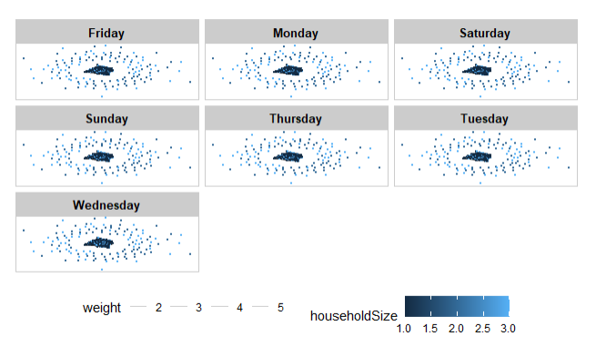
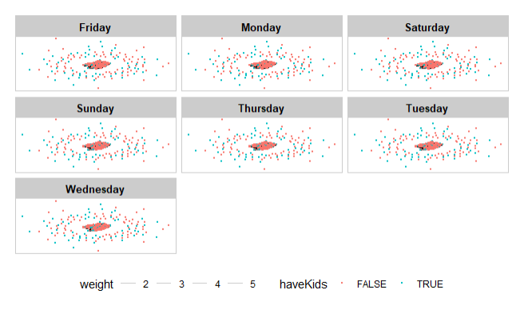
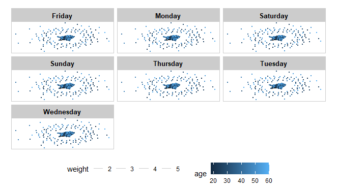
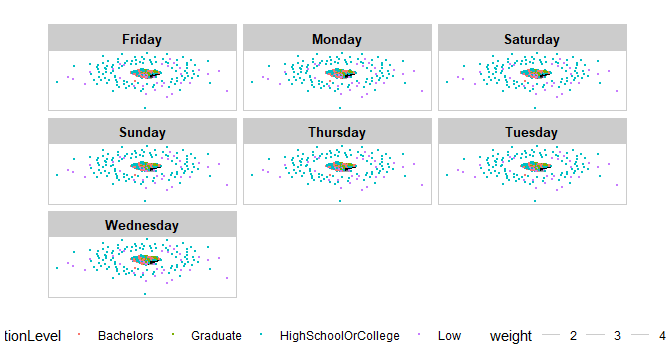
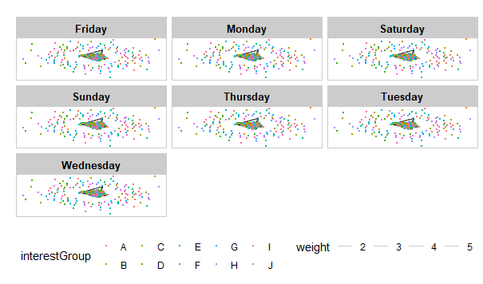
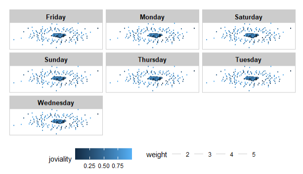

```{r setup, include=FALSE}
knitr::opts_chunk$set(echo = FALSE)
```

# The Task

This [takehome exercise](https://isss608-ay2021-22april.netlify.app/th_ex/th_ex06) aims to sharpen the skill of building data visualisation programmatically using appropriate tidyverse family of packages and the preparation of statistical graphics using ggplot2 and its extensions. The specific requirements can be found in the screenshot below.



You can find the links to then datasets [here](https://vast-challenge.github.io/2022/).

# Exploration

## Initialisation

### Getting Packages

The code chunk below is used to install and load the required packages onto RStudio.

```{r}
packages = c('igraph', 'tidygraph', 
             'ggraph', 'visNetwork', 
             'lubridate', 'clock',
             'tidyverse', 'graphlayouts')
for (p in packages){
  if(!require(p, character.only = T)){
    install.packages(p)
  }
  library(p,character.only = T)
}
```

### Getting Data

The code chunk below is used to load the necessary data.

```{r, eval=FALSE}
socialNetworkNodes <- read_csv("data/Participants.csv")

socialNetworksEdges <- read_csv("data/SocialNetwork.csv")

glimpse(socialNetworkNodes)
glimpse(socialNetworksEdges)
```



We convert the timestamp for *socialNetworksEdges* into date for consistency and ease of use. Also, given that there are 7,482,488 rows in the dataset *socialNetworksEdges*, we use the data for just one month first to make the analysis easier with the code chunk below.

```{r, eval=FALSE}
socialNetworksEdges <- socialNetworksEdges %>%
  mutate(timestamp = as.Date(timestamp, format = "%m/%d/%y"))

socialNetworksEdges$monthyear <- format(as.Date(socialNetworksEdges$timestamp), "%Y-%m")

#Let us go a step further by finding out what day of the week each date falls on with the code chunk below.
socialNetworksEdges <- socialNetworksEdges %>%
  mutate(weekday = wday(timestamp,
                        label = TRUE,
                        abbr = FALSE))

# Let us filter out one week to reduce the number of datapoints
socialNetworksEdgesMar22 <- filter(socialNetworksEdges, monthyear == "2022-03")

# socialNetworksEdgesMar22 <- filter(socialNetworksEdges, timestamp <= "2022-03-07")

socialNetworksEdgesMar22 <- select(socialNetworksEdgesMar22, -c(monthyear))
```

We add a weight column to the dataset *socialNetworksEdgesMar22* with the code chunk below.

```{r, eval=FALSE}
socialNetworksEdgesMar22_aggregated <- socialNetworksEdgesMar22 %>%
  group_by(participantIdFrom, participantIdTo, weekday) %>%
  summarise(weight = n()) %>%
  filter(participantIdFrom!=participantIdTo) %>%
  filter(weight > 1) %>%
  ungroup()
```

Let us export and reimport the necessary datasets to minimise the load on Git later.

```{r, eval=FALSE}
write_csv(socialNetworksEdgesMar22_aggregated, "data/socialNetworksEdgesMar22_aggregated.csv")
```

```{r}
socialNetworkNodes <- read_csv("data/Participants.csv")

socialNetworksEdgesMar22_aggregated <- read_csv("data/socialNetworksEdgesMar22_aggregated.csv")

glimpse(socialNetworkNodes)
glimpse(socialNetworksEdgesMar22_aggregated)
```

Let us also add 1 to all the columns that relate to a *participantId*. This is because pacakge *tidygraph* does not accept the value 0.

```{r}
socialNetworkNodes$participantId <- socialNetworkNodes$participantId + 1

socialNetworksEdgesMar22_aggregated$participantIdFrom <- socialNetworksEdgesMar22_aggregated$participantIdFrom + 1
socialNetworksEdgesMar22_aggregated$participantIdTo <- socialNetworksEdgesMar22_aggregated$participantIdTo + 1
```

Now that we have the edges and nodes, we create the network graph with the code chunk below.

```{r}
socialNetworkGraph <- tbl_graph(nodes = socialNetworkNodes,
                           edges = socialNetworksEdgesMar22_aggregated, 
                           directed = TRUE)

socialNetworkGraph
```

Now we activate the graph with the code chunk below.

```{r}
socialNetworkGraph %>%
  activate(edges) %>%
  arrange(desc(weight))
```

# Visualisation

## Insights

### Household Size

We draw the graph for household size using the code chunk below.

```{r, eval=FALSE}
set_graph_style()

g <- ggraph(socialNetworkGraph, 
            layout = "nicely") + 
  geom_edge_link(aes(width=weight), 
                 alpha=0.2) +
  scale_edge_width(range = c(0.1, 0.5)) +
  geom_node_point(aes(colour = householdSize, 
                  size = 0.3))

g + facet_edges(~weekday)+
  th_foreground(foreground = "grey80",  
                border = TRUE) +
  theme(legend.position = 'bottom')
```



In general, it does seem like smaller household interact more than larger households. In addition, the interaction between smaller households is additionally intense on Fridays.

### Have Kids

We draw the graph for have kids using the code chunk below.

```{r, eval=FALSE}
set_graph_style()

g <- ggraph(socialNetworkGraph, 
            layout = "nicely") + 
  geom_edge_link(aes(width=weight), 
                 alpha=0.2) +
  scale_edge_width(range = c(0.1, 0.5)) +
  geom_node_point(aes(colour = haveKids), 
                  size = 0.3)

g + facet_edges(~weekday)+
  th_foreground(foreground = "grey80",  
                border = TRUE) +
  theme(legend.position = 'bottom')
```



In general, it does seem like single individuals hang out with each other a lot more. This could be because single people have less responsibilities and tasks. This could also be because children count as single people as well, and that might skew the statistic a little.

### Age

We draw the graph for age using the code chunk below.

```{r, eval=FALSE}
set_graph_style()

g <- ggraph(socialNetworkGraph, 
            layout = "nicely") + 
  geom_edge_link(aes(width=weight), 
                 alpha=0.2) +
  scale_edge_width(range = c(0.1, 0.5)) +
  geom_node_point(aes(colour = age), 
                  size = 0.3)

g + facet_edges(~weekday)+
  th_foreground(foreground = "grey80",  
                border = TRUE) +
  theme(legend.position = 'bottom')
```



There's quite an even mix in terms of interaction between people of all ages.

### Education Level

We draw the graph for education level using the code chunk below.

```{r, eval=FALSE}
set_graph_style()

g <- ggraph(socialNetworkGraph, 
            layout = "nicely") + 
  geom_edge_link(aes(width=weight), 
                 alpha=0.2) +
  scale_edge_width(range = c(0.1, 0.5)) +
  geom_node_point(aes(colour = educationLevel), 
                  size = 0.3)

g + facet_edges(~weekday)+
  th_foreground(foreground = "grey80",  
                border = TRUE) +
  theme(legend.position = 'bottom')
```



There seems to be an even mix between people of all education levels. However, graduates from high school or college tend to be the ones most likely to be less socially interactive when compared to others.

### Interest Group

We draw the graph for interest group using the code chunk below.

```{r, eval=FALSE}
set_graph_style()

g <- ggraph(socialNetworkGraph, 
            layout = "nicely") + 
  geom_edge_link(aes(width=weight), 
                 alpha=0.2) +
  scale_edge_width(range = c(0.1, 0.5)) +
  geom_node_point(aes(colour = interestGroup), 
                  size = 0.3)

g + facet_edges(~weekday)+
  th_foreground(foreground = "grey80",  
                border = TRUE) +
  theme(legend.position = 'bottom')
```



There does not seem to be a discerning pattern for participants and their interest groups.

### Joviality

We draw the graph for joviality using the code chunk below.

```{r, eval=FALSE}
set_graph_style()

g <- ggraph(socialNetworkGraph, 
            layout = "nicely") + 
  geom_edge_link(aes(width=weight), 
                 alpha=0.2) +
  scale_edge_width(range = c(0.1, 0.5)) +
  geom_node_point(aes(colour = joviality), 
                  size = 0.3)

g + facet_edges(~weekday)+
  th_foreground(foreground = "grey80",  
                border = TRUE) +
  theme(legend.position = 'bottom')
```



In general, the happier participants tend to be more socially interactive. Perhaps there could be a correlation between the 2 factors.

# Conclusion

This was admittedly a very amateur attempt at building a network, and I did struggle with getting *tidygraph* to work. Future improvements will include learning how to manage this many datapoints (51,650) and also configuring the network graphs so that they are less cluttered. 


